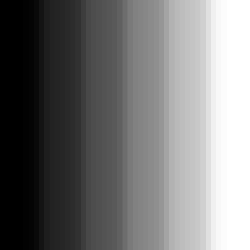
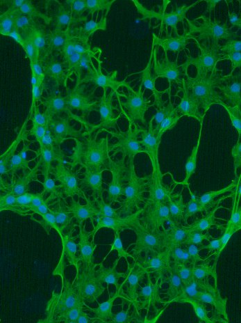

% Image analysis in R
% Tommaso Leonardi
% tl344@ebi.ac.uk


# A couple of covenient packages for image manipulation in R
1. EBImage

```r
source("http://bioconductor.org/biocLite.R")
biocLite("EBImage")
```


# The simplest image
An image in R is just a matrix where 0 is black and 1 is white

```r
simple_image <- matrix(seq(0,1,by=0.2), nrow=6, ncol=6)
simple_image
```

```
##      [,1] [,2] [,3] [,4] [,5] [,6]
## [1,]  0.0  0.0  0.0  0.0  0.0  0.0
## [2,]  0.2  0.2  0.2  0.2  0.2  0.2
## [3,]  0.4  0.4  0.4  0.4  0.4  0.4
## [4,]  0.6  0.6  0.6  0.6  0.6  0.6
## [5,]  0.8  0.8  0.8  0.8  0.8  0.8
## [6,]  1.0  1.0  1.0  1.0  1.0  1.0
```

The _display_ function in EBImage makes it easy to visualise a matrix

```r
display(simple_image, method="raster")
```

 

# Loading external images
Reading an image from a file is as easy as:

```r
queen <- readImage("HRH_ERII.tif")
queen <- resize(queen, w=200, h=260)
```


```r
queen
```

```
## Image 
##   colorMode    : Grayscale 
##   storage.mode : double 
##   dim          : 200 260 
##   frames.total : 1 
##   frames.render: 1 
## 
## imageData(object)[1:5,1:6]
##           [,1]      [,2]      [,3]      [,4]      [,5]      [,6]
## [1,] 0.6000000 0.5680543 0.5703469 0.5708296 0.5669985 0.5380090
## [2,] 0.5921569 0.5756109 0.5647059 0.5538009 0.5838311 0.5647059
## [3,] 0.6039216 0.5876621 0.5641327 0.5490196 0.5681448 0.5853695
## [4,] 0.5803922 0.5806787 0.5837406 0.5747511 0.5619306 0.5554299
## [5,] 0.5764706 0.5957919 0.5843137 0.5694872 0.5776169 0.5625189
```

```r
writeImage(queen, 'img/queen_1.jpg', quality=85)
```


# Modifying the brightness

Adding a constant to every pixel increses the brightness

```r
newQueen <- queen + 0.2
plot(as.numeric(queen), as.numeric(newQueen), pch=19, ylim=c(0,1), xlim=c(0,1))
```

 

```r
writeImage(newQueen, 'img/brightQueen.jpg', quality=85)
```
 


# Modifying the contrast

Multiplying a constant to every pixel increses the constrast

```r
newQueen <- queen * 2
plot(as.numeric(queen), as.numeric(newQueen), pch=19, ylim=c(0,1), xlim=c(0,1))
```

 

```r
writeImage(newQueen, 'img/contrastQueen.jpg', quality=85)
```
 


# Modifying the gamma

Exponentiating every pixel increses the gamma

```r
newQueen <- queen ^ 2
plot(as.numeric(queen), as.numeric(newQueen), pch=19, ylim=c(0,1), xlim=c(0,1))
```

 

```r
writeImage(newQueen, 'img/gammaQueen.jpg', quality=85)
```
 


# Other operations on the matrix

## Transposition

```r
newQueen <- t(queen)
writeImage(newQueen, 'img/transQueen.jpg', quality=85)
```


## Thresholding

```r
newQueen <- queen>0.5
writeImage(newQueen, 'img/thrQueen.jpg', quality=85)
```


# Filtering
Filtering allows to apply various effects to an image. In its simplest form, you center a filter matrix on each pixel of the image and you reset the value of the pixel to the sum of pixel-wise products between the image and the filter matrix.
This is a filter matrix:

```r
filt = matrix(1, nc=5, nr=5)
filt <- filt / sum(filt)
filt
```

```
##      [,1] [,2] [,3] [,4] [,5]
## [1,] 0.04 0.04 0.04 0.04 0.04
## [2,] 0.04 0.04 0.04 0.04 0.04
## [3,] 0.04 0.04 0.04 0.04 0.04
## [4,] 0.04 0.04 0.04 0.04 0.04
## [5,] 0.04 0.04 0.04 0.04 0.04
```
Now imagine to position the central pixel of this filter on one pixel of the image. Then you multiply one by one the pixels of the filter with the pixels of the image covered by the filter. The new value for the central pixel will be the sum of all these products. You then repeat the same procedure after positioning the filter on every pixel in the image.
We divide the filter matrix by its sum so that the sum of the matrix is always 1 (if we didn't we would increase the overall intensity if the image).

The function _filter2_ of EBImage does this procedure for us:

```r
newQueen <- filter2(queen, filt)
writeImage(newQueen, 'img/lofiltQueen.jpg', quality=85)
```
 


# Sharpening
Sharpening an image is the result of applying yet another filter on it.

This is a filter matrix that would sharpen the image:

```r
filt = matrix(-1, nc=3, nr=3)
filt[2,2] <- 9
filt
```

```
##      [,1] [,2] [,3]
## [1,]   -1   -1   -1
## [2,]   -1    9   -1
## [3,]   -1   -1   -1
```
The pixel intensity has a strong positive weight, while its neighbours have a small negative one. The sum of all pixels is 1, so that the overall intensity of the image doesn't change.


```r
newQueen <- filter2(queen, filt)
writeImage(newQueen, 'img/sharpQueen.jpg', quality=85)
```
 


# Can we use R to make something useful?
Given an image of this type:

```r
tif_files <- as.Image(readTIFF("astrocytes.tiff"))
colorMode(tif_files) <- "color"
nuc <- tif_files[,,1]
cel <- tif_files[,,3]
img = rgbImage(green=cel, blue=nuc)
writeImage(resize(img, w=347, h=464), 'img/img.jpg', quality=86)
```


Can you tell me how many cells there are, what is the cell size distribution and what is the bistribution of signal intensities cell-by-cell?


